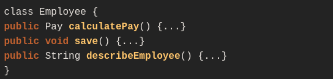
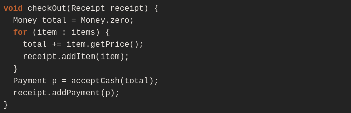
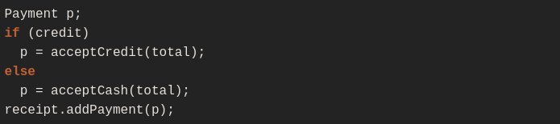
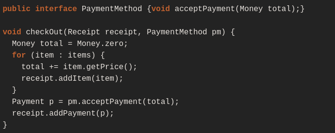
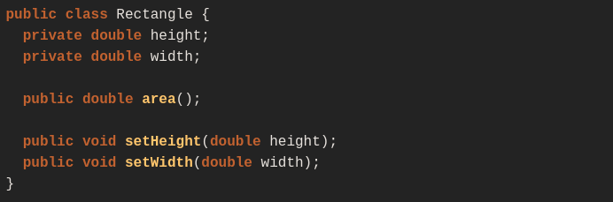
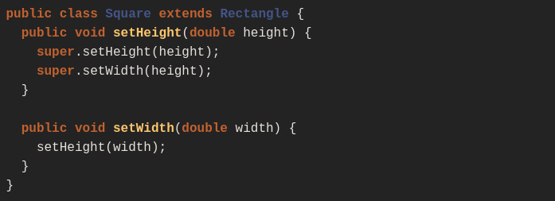
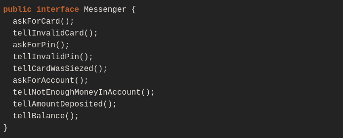
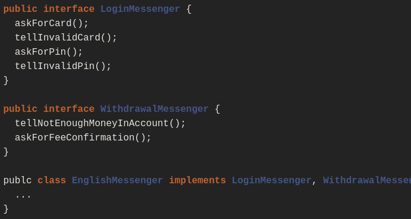
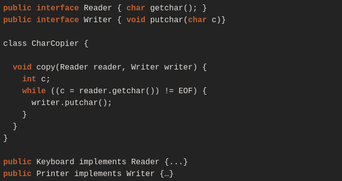
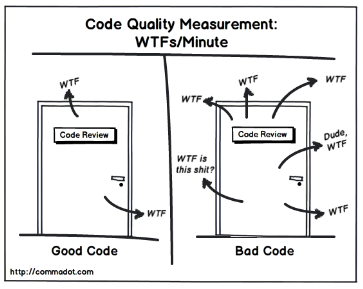

# ESTÁNDARES DE CÓDIGO

## 1. NAMING CONVENTIONS
- Los nombres de los paquetes se escriben en minúsculas, p. Ej. javax.sqlcom.newpackagejava.langcom.newPackagecom.new_package
- Los nombres de clase, enumeración, interfaz y anotación se escriben en UpperCamelCase, p. Ej ThreadRunnablePerson.		
- Las constantes son tipos en mayúsculas separados por un guión bajo, p. Ej. SIZE, MIN_FILE, MAX_VALUE
- Los nombres de las interfaces utilizarán el sufijo de la interfaz y estarán formados por palabras con la primera letra en mayúsculas (CamelCase). Debe evitarse el uso de abreviaturas que hagan que el código sea difícil de entender.
    - Ejemplo: ConnectionInterface, ComponentTableInterface
- Los nombres de los métodos son verbos y se escriben en un lowerCamelCase, p. Ej. deleteCharAt (), add (), isNull ().
- Las variables se escriben en lowerCamelCase e.g. employeeName, birthDate, email. El nombre debe ser corto y tal que le diga al lector del programa lo que almacena esta variable.

## 2. STATEMENTS
- Se recomienda una declaración por línea, ya que fomenta los comentarios y mejora la claridad del código.
- Las variables estáticas / de clase deben colocarse en la secuencia: Primero las variables de clase pública, protegido, paquete / nivel predeterminado, es decir, sin modificador de acceso y luego el privado.
- A continuación, los constructores de clases deben declararse seguidos de las clases internas, si corresponde.
- Debe evitarse el mismo nombre de variable en un bloque interno que el de la variable global.
- Las constantes numéricas no deben codificarse directamente.


## 3. ORGANIZATION OF THE SOURCE FILE
- Cada archivo fuente de Java debe contener una sola clase o interfaz. Cada clase debe colocarse en un archivo separado.
- La longitud del archivo de origen debe ser inferior a 300 líneas de código.
- Se prefiere que el número máximo de parámetros en cualquier clase sea 5.
- Deben evitarse las líneas fuera de la pantalla. Cuando una expresión no cabe en una sola línea (más de 70 a 120 caracteres), debe separarse después de una coma o un operador.
- Las funciones normalmente deben ser cortas, entre 5 y 15 líneas, pero esta no es una regla absoluta. Puede haber casos en los que una función sea una sola instrucción de cambio grande o, a veces, tener una función más grande puede ser ventajoso. Pero siempre que sea aplicable, intente ceñirse a los tamaños de función pequeños.

## 4. COMMENT CODES
- Comentarios de documentación: luego podemos usar Javadoc (una herramienta que viene con JDK) para generar documentación de código Java en formato HTML a partir del código fuente de Java. Debe estar escrito en un formato específico.
- Se deben comentar todas las variables de tipo privado o protegido.
- Según las etiquetas tenemos lo siguiente:
- @param seguido del nombre del parámetro y sangrado su descripción. Por lo general, esta descripción será una frase corta que comienza definiendo el tipo de parámetro.
     - @param BoxHeight Entero que define la altura del cuadro en píxeles
     - @param floatingBoxlength que define la longitud del cuadro en píxeles
- @return esta etiqueta no aparece para aquellos métodos que devuelven void.
- De lo contrario, se comporta como la etiqueta anterior.
- @throws Breve descripción de la posible causa de la excepción.
- @see Su uso está restringido en cuanto a su cantidad como con el atributo @link.
- Comentarios de implementación: estos comentarios describen una implementación particular del código.
- Comentario de bloque: se utiliza para proporcionar descripciones de archivos, métodos, estructuras de datos y algoritmos. Los comentarios de bloque deben usarse al principio de cada archivo y en los lugares donde se debe explicar el código.
     - Comentario de una sola línea: los comentarios breves pueden aparecer en una sola línea. Esto permite agregar texto explicativo al código.
     - Comentarios finales: se utilizan para explicar una sola línea de código.
     - Comentario de fin de línea: no debe usarse en varias líneas consecutivas para comentarios de texto; sin embargo, se puede utilizar en varias líneas consecutivas para comentar secciones de código.

## 5. MISSCELLANEOUS
- No debemos documentar los métodos anulados a menos que la implementación haya cambiado.
- No omita llaves {} en condicionales.
- En los casos de interruptor, siempre tenga un caso predeterminado incluso sin código.
- Una declaración de retorno con un valor no debe usar paréntesis a menos que hagan que el valor de retorno sea más obvio de alguna manera.
- Los mensajes deben estar debidamente sangrados y organizados de manera que sean fáciles de leer.

## 6. PROPOSAL
- Ofuscación de código Modifica un ejecutable para que ya no sea útil para un pirata informático y resulte ventajoso porque nuestro código sigue siendo funcional. Algunas opciones serían: Proguard, Fuck, Jarg y Yguard.
- La programación declarativa especifica el resultado deseado, no como logro y la programación imperativa es una secuencia de opciones a realizar. Debemos saber al aplicar estos enfoques
- Proponemos dos patrones que hemos visto que son muy utilizados en microservicios: DDD y Singleton

## 7. SOLID
### Principio de responsabilidad única: 
- Establecer que nunca debe haber más de una razón para cambiar una clase. Esto significa que cada clase, o estructura similar, en su código debe tener solo un trabajo por hacer.


### Principio abierto-cerrado: 
- Establece que las clases deben estar abiertas para extensión pero cerradas para modificación. "Abierto a la extensión" significa que debe diseñar sus clases para que se puedan agregar nuevas funciones a medida que se generen nuevos requisitos. “Cerrado para modificación” significa que una vez que haya desarrollado una clase, nunca debe modificarla, excepto para corregir errores.
- Ejemplo: Tenemos este pedazo de código que verifica el pago. 


- Entonces, ¿cómo agregamos soporte para tarjetas de crédito? Podría agregar una declaración "si" como esta


- Aquí hay una mejor solución donde implementamos una interfaz que se encargue de agregar soporte para tarjetas de crédito, pero sin modificar la clase actual



### El principio de sustitución de Liskov:
- Se aplica a las jerarquías de herencia, especificando que debe diseñar sus clases para que las dependencias del cliente se pueden sustituir por subclases sin que el cliente sepa sobre el cambio.
- Ejemplo: tenemos una clase Rectángulo que tiene atributos y métodos ya definidos, como es el ancho, alto y el área.



- Si extendemos la clase Rectángulo a Cuadrado estiramos violando los métodos, ya que las dimensiones no coinciden. 



### Principio de segregación de interfaces: 
- Establecer que los clientes no deben estar obligados a depender de los miembros de la interfaz que no utilizan. 
- Ejemplo: Tenemos de Mensajes de un cajero y queremos agregar un nuevo mensaje sin afectar a todo el sistema, ni tampoco cambiar funcionalidades no relacionadas.



- Para resolver este caso tenemos que dividir la interfaz de Mensajes en diferentes funciones de los cajeros. 



### Principio de inversión de dependencia: 
- Establecer que los módulos de alto nivel no deben depender de los módulos de bajo nivel; deberían depender de abstracciones, y las abstracciones no deberían depender de los detalles, los detalles deben depender de abstracciones. 
- Ejemplo: Un programa depende de interfaces Reader y Writer que son abstracciones, Keyboard y Printer son detalles que dependen de las abstracciones. Pero CharCopier ignora los detalles de bajo nivel de cualquier implementación de Reader y Writer 



## 8. Define Endpoint
- Acepta y responde con JSON
    - Las API REST deben aceptar JSON para la carga útil de la solicitud y también enviar respuestas a JSON. JSON es el estándar para transferir datos. Casi todas las tecnologías en red pueden usarlo: JavaScript tiene métodos integrados para codificar y decodificar JSON, ya sea a través de Fetch API u otro cliente HTTP. Las tecnologías del lado del servidor tienen bibliotecas que pueden decodificar JSON sin hacer mucho trabajo.

- Use sustantivos en lugar de verbos en las rutas de los extremos
     - No debemos usar verbos en nuestras rutas de puntos finales. En su lugar, deberíamos usar los sustantivos que representan la entidad que es el punto final que estamos recuperando o manipulando como el nombre de la ruta.
     - Esto se debe a que nuestro método de solicitud HTTP ya tiene el verbo. Tener verbos en las rutas de los extremos de nuestra API no es útil y lo hace innecesariamente largo, ya que no transmite ninguna información nueva.
     - La acción debe estar indicada por el método de solicitud HTTP que estamos realizando. Los métodos más comunes incluyen GET, POST, PUT y DELETE.
           - GET recupera recursos.
           - POST envía nuevos datos al servidor.
           - PUT actualiza los datos existentes.
           - DELETE elimina datos.
- Utilice anidamiento lógico en puntos finales
     - Al diseñar puntos finales, tiene sentido agrupar aquellos que contienen información asociada. Es decir, si un objeto puede contener otro objeto, debe diseñar el punto final para reflejarlo. Esta es una buena práctica independientemente de si sus datos están estructurados de esta manera en su base de datos.

- Manejar los errores con elegancia y devolver códigos de error estándar - Control de versiones de nuestras API
    - Para eliminar la confusión de los usuarios de la API cuando ocurre un error, debemos manejar los errores con elegancia y devolver códigos de respuesta HTTP que indiquen qué tipo de error ocurrió.
    - Los códigos de estado HTTP de error comunes incluyen:
          - 400 Bad Request: esto significa que la entrada del lado del cliente falla en la validación.
          - 400 Bad Request: esto significa que el usuario no está autorizado para acceder a un recurso. Por lo general, vuelve cuando el usuario no está autenticado.
          - 403 Forbidden : esto significa que el usuario está autenticado, pero no se le permite acceder a un recurso.
          -  404 Not Found: esto indica que no se encuentra un recurso.
          - 500 Internal server error: se trata de un error genérico del servidor. Probablemente no debería lanzarse explícitamente.
          - 502 Bad Gateway: esto indica una respuesta no válida de un servidor ascendente.
          - 503 Service Unavailable: esto indica que sucedió algo inesperado en el lado del servidor
          
## 9. Nomenclatura de End-points (Servicios Rest)
         - La Nomenclatura Utilizada para el llamado de los servicios rest sera el siguiente
         
## 10. Conclusión

- Como indica el propio Robert C. Martin en su artículo “Getting a SOLID start” no se trata de reglas, ni leyes, ni verdades absolutas, sino más bien soluciones de sentido común a problemas comunes. Son heurísticos, basados en la experiencia: “se ha observado que funcionan en muchos casos; pero no hay pruebas de que siempre funcionen, ni de que siempre se deban seguir.”
- Dice el tío Bob, que SOLID nos ayuda a categorizar lo que es un buen o mal código y es innegable que un código limpio tenderá más a salir airoso del “control de calidad de código” WTFs/Minute. Consejo: cuando estés revisando un código, lleva la cuenta de cuántas veces por minuto sale de tu boca un WTF?



# user Project

Este proyecto utiliza Quarkus, el Supersonic Subatomic Java Framework.

Si desea obtener más información sobre Quarkus, visite su sitio web: https://quarkus.io/.

## Running the application in dev mode

Puede ejecutar su aplicación en modo dev que habilita la codificación en vivo usando:
```shell script
./mvnw compile quarkus:dev
```

> **_NOTE:_**  Quarkus ahora se envía con una interfaz de usuario de desarrollo, que está disponible en modo de desarrollo solo en http://localhost:8080/q/dev/.

## Packaging and running the application

La aplicación se puede empaquetar usando:
```shell script
./mvnw package
```
Produce el archivo `quarkus-run.jar` en el directorio` target / quarkus-app / `.
Tenga en cuenta que no es un _über-jar_ ya que las dependencias se copian en el directorio `target / quarkus-app / lib /`.

La aplicación ahora se puede ejecutar usando `java -jar target / quarkus-app / quarkus-run.jar`.

Si desea construir un _über-jar, ejecute el siguiente comando:
```shell script
./mvnw package -Dquarkus.package.type=uber-jar
```

La aplicación, empaquetada como _über-jar_, ahora se puede ejecutar usando `java -jar target / * - runner.jar`.

## Creating a native executable

Puede crear un ejecutable nativo usando:
```shell script
./mvnw package -Pnative
```

O, si no tiene GraalVM instalado, puede ejecutar la compilación ejecutable nativa en un contenedor usando:
```shell script
./mvnw package -Pnative -Dquarkus.native.container-build=true
```

Luego puede ejecutar su ejecutable nativo con: `. / Target / user-1.0.0-SNAPSHOT-runner`

Si desea obtener más información sobre la creación de ejecutables nativos, consulte https://quarkus.io/guides/maven-tooling.html.
## Provided Code

### RESTEasy JAX-RS

Inicie fácilmente sus servicios web RESTful

[Related guide section...](https://quarkus.io/guides/getting-started#the-jax-rs-resources)
